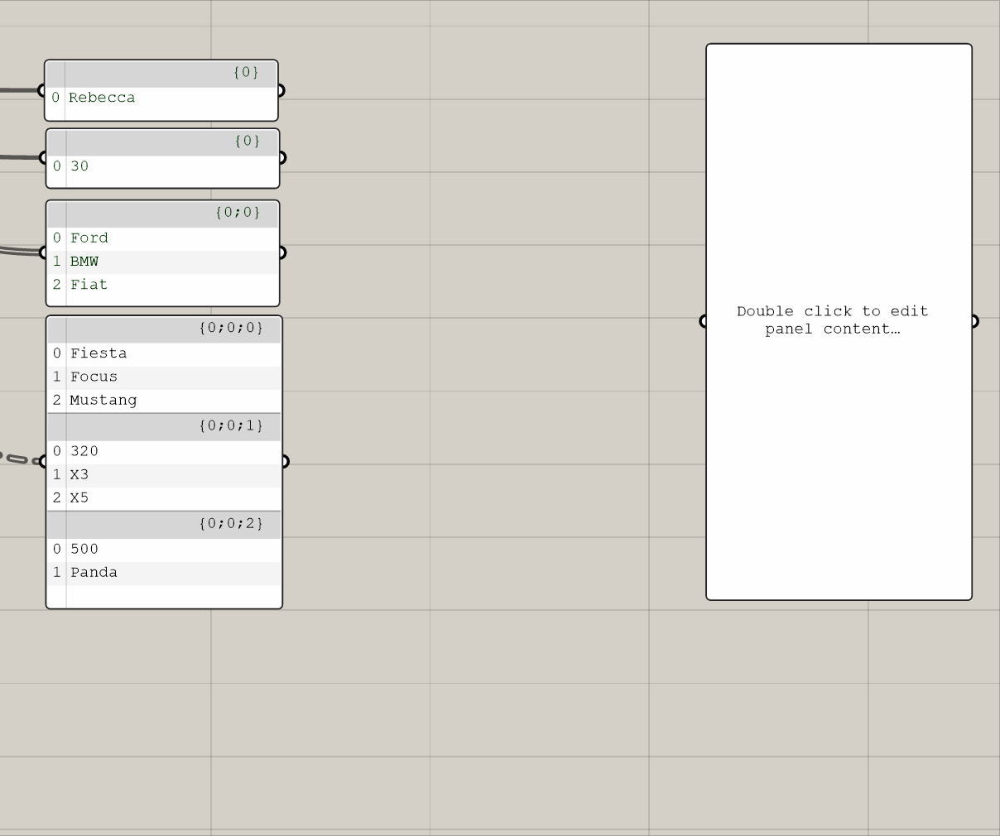
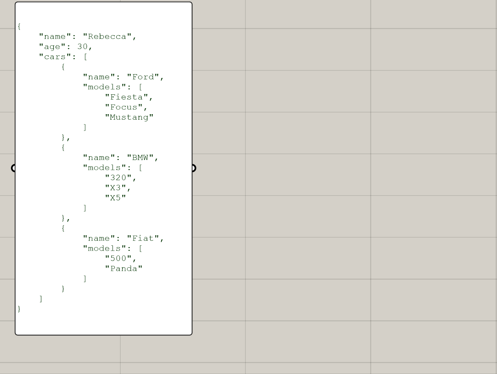
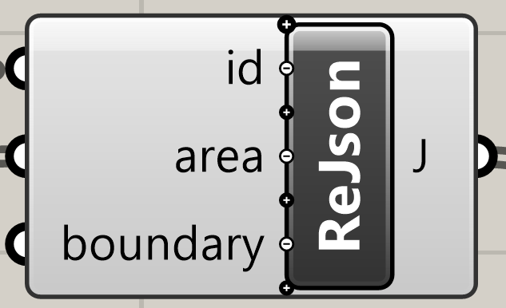
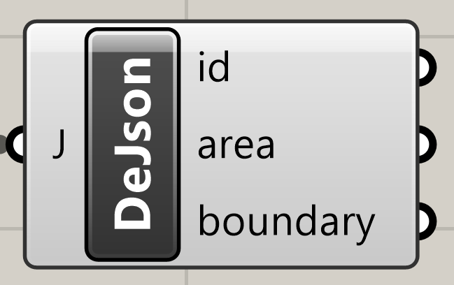
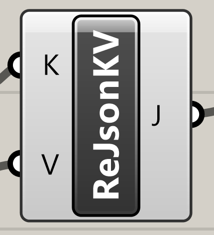
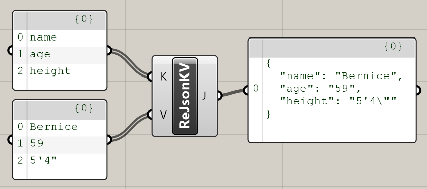
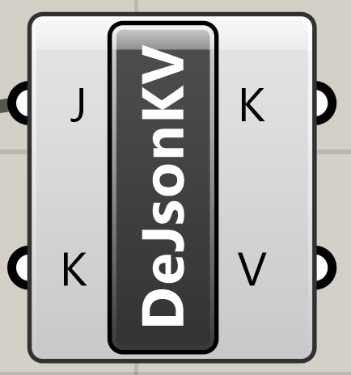
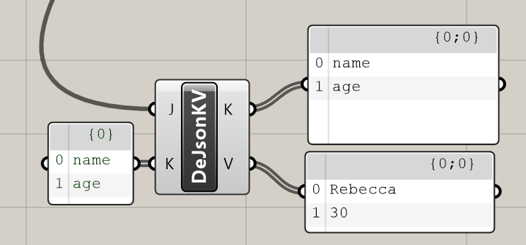

# jSwan
JSON Serialization/Deserialization for Grasshopper 3d

## What is JSwan?  ## 
JSwan is a set of Grasshopper components for easily working with JSON-formatted data. It's desiged to work intuitively with Grasshopper's component logic and data structures.

### What is JSON? ###
According to https://www.w3schools.com/whatis/whatis_json.asp: 
>JSON stands for **J**ava**S**cript **O**bject **N**otation
>
>JSON is a lightweight format for storing and transporting data
>
>JSON is often used when data is sent from a server to a web page
>
>JSON is "self-describing" and easy to understand

Here's an example object, described in JSON:

```
{
    "name": "John",
    "age": 30,
    "cars": [
        {
            "name": "Ford",
            "models": [
                "Fiesta",
                "Focus",
                "Mustang"
            ]
        },
        {
            "name": "BMW",
            "models": [
                "320",
                "X3",
                "X5"
            ]
        },
        {
            "name": "Fiat",
            "models": [
                "500",
                "Panda"
            ]
        }
    ]
}
```

## How do I use jSwan? ##

You can compose JSON Objects with the `Serialize JSON` component, like so: 



The components interact intuitively with Data Trees, and the right-click options allow you to tell the component whether to treat data as individual items/objects or as an array. 

Deconstructing JSON is even easier, with the `Deserialize JSON` component: 



The component automatically generates one output for each unique property of the input data. Each instance of the component deserializes one level of nesting at a time, so that you wind up with a data tree perfectly reflecting the structure of the input data. 

## What would I use this for? ##

It's up to you! There are lots of reasons why you might use a JSON format inside grasshopper. Here are a few: 

* Interacting with the web: data from web services or APIs is often received or sent in JSON format
* Translating Grasshopper / Rhino formatted geometry into a structured format any program can understand (C#, javascript, python, and most other languages have the ability to read and author JSON data, sometimes with the help of third-party libraries.)
* "Object Oriented Grasshopper" - construct custom object types by encoding them in JSON and build your own reusable clusters that grab their relevant properties, rather than passing around many parallel data streams. For example, rather than passing along a list of panels, a list of their IDs, and a list of their areas or other data, you could construct a single list of panel JSON objects: 
    ```
    {
    "id": "P034",
    "area": 2.0,
    "boundary": [
        {
        "X": 4.0,
        "Y": 0.0,
        "Z": 0.0
        },
        {
        "X": 4.0,
        "Y": 2.0,
        "Z": 0.0
        },
        {
        "X": 3.0,
        "Y": 2.0,
        "Z": 0.0
        },
        {
        "X": 3.0,
        "Y": 0.0,
        "Z": 0.0
        }
    ]
    }
    ```  

## Detailed Features ##
### Serialize JSON ###



Create JSON structures from data you feed in. Use the ZUI (Zoomable UI) to add additional properties as needed. The name you give each parameter will be the name of the JSON Property. Each input will correspond to a property. Right click each input to choose between "Item access" (Treat each object in the input list as a single item) and "List Access" (treat the entire list as an array). Note that the execution of this component follows normal grasshopper list matching behavior, so if property values seem to be "attached" to the wrong objects, check your tree structure. The component uses default object serialization, so if you pass simple types like Points and Vectors, they will automatically serialize as objects with X, Y, and Z properties. 

The component also has a right-click menu item "Lock Structure," which will force the component to include null and empty properties in the resulting object rather than omitting them. You can choose "Lock All Serialize Components" to lock all the serialize components in your definition. 

### Deserialize JSON ###



Extract data from JSON structures you feed in. 
For each top-level property of the JSON object, it will generate an output. Properties with simple values (numbers, strings, booleans, etc) will simply output the value; those with objects as values will simply spit out the JSON-formatted contents, so you can chain together another component to deconstruct further. Array properties are broken automatically into lists of values or objects. If the topmost JSON object is itself an array, it will generate a single output called "array."

Outputs are generated automatically from the unique property names in the data. This means if the input data changes, the component itself may change "shape" by adding/removing outputs. To prevent this from happening, right click to "Lock" the structure of the component - this will prevent its structure from changing, and missing properties will come out as empty lists or nulls. You can choose "Lock All Deserialize Components" to lock all the deserialize components in your definition. 


### Serialize Keys and Values ###



This component allows you to explicitly provide a list of values for the keys and values of a JSON object, rather than editing the param input names as you do with the regular Serialize component. 



### Deserialize Keys and Values ###



This component lets you deconstruct JSON into lists of keys and values, rather than producing a separate output for every property. You can also supply an optional key input to select only certain keys from an object. 




### Thanks ###
Special thanks to Jonatan Schumacher, Leland Jobson, Serena Li, and Brian Ringley for their contributions to this project as users, testers, and contributors! 